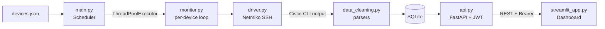

# Cisco Switch Monitor

**Languages:** [English](README.md) · [繁體中文](README.zh-TW.md)

Real-time monitoring system for Cisco network devices (Catalyst 9000 / IOS-XE). Collects metrics over SSH using Netmiko, persists time-series data to SQLite, and serves a web dashboard with interactive charts, interface/VLAN status tables, and CSV export.


**Demo video (YouTube):** [Watch on YouTube](https://youtu.be/_uXNgmTwpDw) — full walkthrough: login, live metric charts, interface/VLAN tables, multi-device concurrent collection, and HTTPS setup.

---

## Overview



Each device runs in a dedicated thread. Raw CLI output is parsed immediately and written to SQLite. The FastAPI backend exposes REST endpoints for the Streamlit dashboard, which polls for updates and renders time-series charts and status tables.

---

## Core Features

| Area | Details |
|------|---------|
| **Concurrent collection** | `ThreadPoolExecutor` monitors multiple switches simultaneously; each device runs an independent polling loop |
| **6 built-in metrics** | `cpu`, `memory`, `version` (uptime days), `vlan` (count), `interfaces` (detailed status), `interfaces_summary` (up count) |
| **Extensible parsers** | `data_cleaning.py` maps metric keys to parser functions; add a new parser without touching other modules. Hot-reload via `/reload-parsers` |
| **REST API** | FastAPI with OAuth2 password flow (JWT); protected endpoints return cleaned, time-series, and raw records |
| **Interactive dashboard** | Login page → metric selector → Altair time-series chart (zoom/pan on x-axis) → interface & VLAN tables; metric choice persisted via `st.session_state` |
| **CSV export** | Dashboard exports current view to CSV directly from the browser |
| **HTTPS** | mkcert for trusted local certificates; nginx reverse proxy with custom domain (`monitor.switch.test`) |
| **Simulation** | `sim/fake_switch_ssh.py` — Paramiko-based local SSH server for offline testing |

---

## Tech Stack

| Layer | Technology |
|-------|-----------|
| Python | 3.10+ |
| SSH / device | Netmiko 4.3.0, Paramiko |
| Concurrency | `ThreadPoolExecutor` (stdlib) |
| Database | SQLite (stdlib) |
| API backend | FastAPI, Uvicorn |
| Auth | OAuth2 password flow, PyJWT |
| Dashboard | Streamlit, Altair, pandas, httpx |
| HTTPS | mkcert, nginx |
| Logging | `RotatingFileHandler` (10 MB × 5 backups) |
| Target devices | Cisco IOS-XE / Catalyst 9000 |

---

## Use Cases

- Multi-device network health dashboard for internal ops teams
- Portfolio demonstration of SSH automation, time-series data pipelines, and REST API design
- Baseline for extending to Juniper / Arista / HP by swapping parser functions

---

## Prerequisites

- Python 3.10+
- SSH access to target Cisco devices (IOS / IOS-XE / Catalyst 9000)
- [Cisco DevNet sandbox](https://developer.cisco.com/) (free; no hardware required for testing)

---

## Quick Start

```bash
git clone <repository-url>
cd switch
python -m venv venv
source venv/bin/activate        # Windows: venv\Scripts\activate
pip install -r requirements.txt
cp devices.json.example devices.json
# Edit devices.json with your device IPs, credentials, and commands
bash scripts/restart_all.sh
```

Open **http://localhost:8501** (dashboard) or **http://localhost:8000/docs** (API).

---

## Configuration

### Device list (`devices.json`)

```json
[
  {
    "name": "DevNet_Catalyst9000",
    "ip": "devnetsandboxiosxec9k.cisco.com",
    "port": 22,
    "username": "your_username",
    "password": "your_password",
    "device_type": "cisco_ios",
    "timeout": 15,
    "collect_commands": [
      { "key": "version",             "command": "show version" },
      { "key": "cpu",                 "command": "show processes cpu" },
      { "key": "memory",              "command": "show memory statistics" },
      { "key": "interfaces",          "command": "show interfaces status" },
      { "key": "vlan",                "command": "show vlan brief" },
      { "key": "interfaces_summary",  "command": "show interfaces summary" }
    ]
  }
]
```

Multiple entries in the array are monitored concurrently.

### Environment variables (`.env`)

| Variable | Description | Default |
|----------|-------------|---------|
| `ADMIN_USER` | Dashboard / API login username | `admin` |
| `ADMIN_PWD` | Dashboard / API login password | `admin` |
| `JWT_SECRET` | JWT signing secret | `change-me-in-production` |
| `MONITOR_DB_DIR` | Database directory | `data` |
| `MONITOR_DB_NAME` | Database filename | `dvt_monitor_results.db` |

---

## Usage

### Start all services (recommended)

```bash
bash scripts/restart_all.sh
```

Kills any running instances, clears Python cache, then starts three background processes via `nohup`:

| Process | Command | Port | Log |
|---------|---------|------|-----|
| Collector | `python main.py` | — | `logs/main.log` |
| API | `uvicorn api:app` | 8000 | `logs/api.log` |
| Dashboard | `streamlit run streamlit_app.py` | 8501 | `logs/streamlit.log` |

### Manual start (three terminals)

```bash
# Terminal 1 — data collection
python main.py

# Terminal 2 — API
uvicorn api:app --host 0.0.0.0 --port 8000

# Terminal 3 — dashboard
streamlit run streamlit_app.py --server.port 8501 --server.address 0.0.0.0
```

### Access

| Service | URL |
|---------|-----|
| Dashboard | http://localhost:8501 |
| Dashboard (HTTPS) | https://monitor.switch.test *(nginx + mkcert)* |
| API docs (Swagger) | http://localhost:8000/docs |
| Health check | http://localhost:8000/health |

---

## API Endpoints

| Method | Endpoint | Auth | Description |
|--------|----------|------|-------------|
| POST | `/token` | No | OAuth2 password flow → JWT |
| GET | `/health` | No | Health check + parser status |
| GET | `/reload-parsers` | No | Hot-reload `data_cleaning` module |
| GET | `/records` | Bearer | Raw monitoring records |
| GET | `/cleaned` | Bearer | Parsed records (structured fields) |
| GET | `/time_series` | Bearer | Time-series data for charting |
| GET | `/devices` | Bearer | Device list (passwords masked) |

---

## Dashboard Features

1. **Login** — Authenticates against the FastAPI `/token` endpoint
2. **Metric selector** — Choose from `cpu`, `memory`, `version`, `vlan`, `interfaces_summary`; selection is preserved across data reloads via `st.session_state`
3. **Time-series chart** — Altair chart with interactive x-axis zoom and pan; one line per device
4. **Interface table** — Per-interface status from `show interfaces status`
5. **VLAN table** — VLAN list from `show vlan brief`
6. **CSV export** — Download the current dataset as a `.csv` file

---

## HTTPS (local development)

For a browser-trusted `https://` URL without purchasing a domain:

- **Linux / WSL2**: See [`docs/HTTPS_SETUP.md`](docs/HTTPS_SETUP.md)
- **WSL2 + Windows browser**: See [`docs/HTTPS_WSL2_WINDOWS.md`](docs/HTTPS_WSL2_WINDOWS.md) — cert must be generated on Windows, then copied to WSL for nginx

---

## Project Structure

```
switch/
├── main.py                  # Entry point — loads devices.json, runs scheduler
├── api.py                   # FastAPI backend
├── streamlit_app.py         # Streamlit dashboard
├── monitor.py               # Per-device monitoring loop
├── driver.py                # Netmiko SSH wrapper
├── scheduler.py             # ThreadPoolExecutor task runner
├── data_cleaning.py         # CLI output parsers (hot-reloadable)
├── database.py              # SQLite read/write helpers
├── logger_config.py         # Rotating log configuration
├── config.py                # Central config — all env vars read here
├── devices.json.example     # Device config template (safe to commit)
├── .env.example             # Env var template (safe to commit)
├── requirements.txt
├── images/                  # Screenshots used in this README
├── sim/
│   └── fake_switch_ssh.py   # Paramiko SSH server for offline testing
├── scripts/
│   ├── restart_all.sh       # Start all services (nohup background)
│   └── setup_https_mkcert.sh
├── certs/                   # SSL certificates (gitignored)
├── data/                    # SQLite database file (gitignored)
├── logs/                    # Rotating log files (gitignored)
└── docs/
    ├── HTTPS_SETUP.md
    ├── HTTPS_WSL2_WINDOWS.md
    └── TECHNICAL_OVERVIEW.md
```

---

## Security Notes

- `devices.json` (real credentials) is gitignored — only `devices.json.example` is committed
- `certs/`, `data/`, and `logs/` are gitignored
- Set a strong `JWT_SECRET` before any non-local deployment

---

## License

MIT
