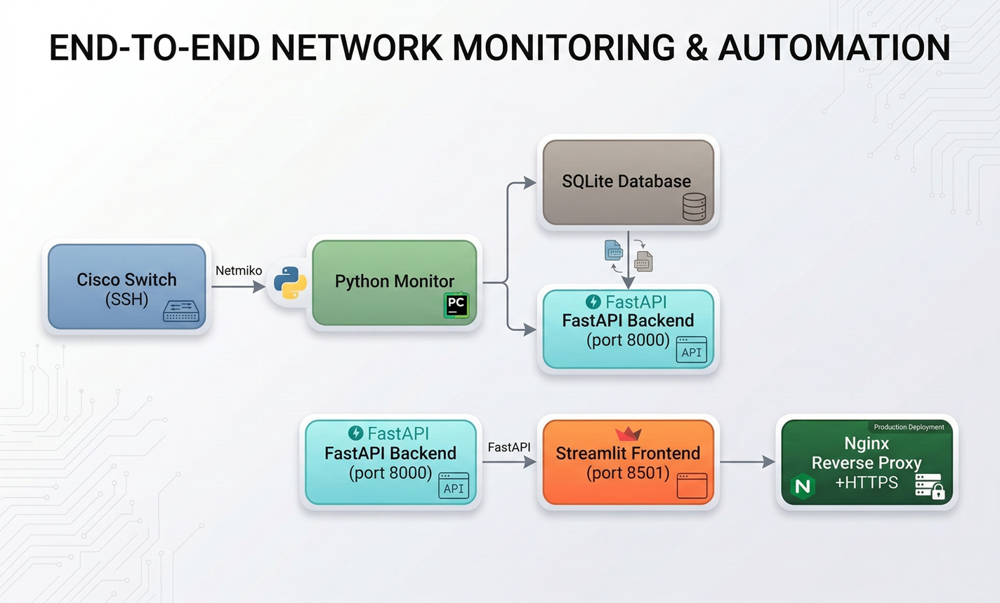
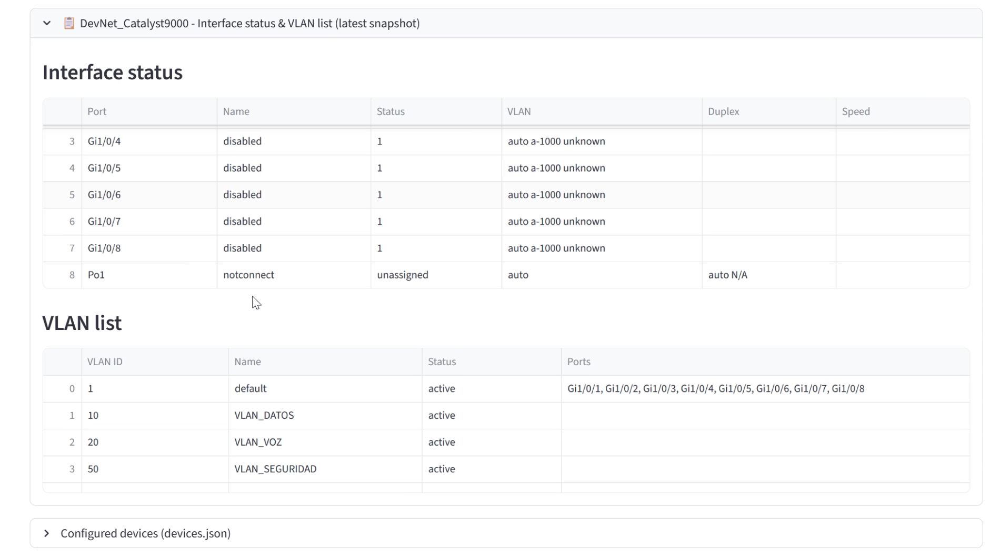

# Cisco Switch Monitor

A real-time monitoring system for Cisco network devices (Catalyst 9000 and compatible). Collects metrics via SSH/Netmiko, stores data in SQLite, and provides a web dashboard with time-series charts and interface/VLAN status tables.


## Features

- **Multi-device concurrent monitoring** — Monitor multiple switches simultaneously via `ThreadPoolExecutor`
- **Configurable metrics** — CPU, memory, version (uptime), VLAN count, interface status, and more
- **REST API** — FastAPI backend with JWT authentication
- **Interactive dashboard** — Streamlit UI with time-series charts (Altair), metric selector, and interface/VLAN tables
- **Data parsing** — Extensible parsers for Cisco CLI output (Catalyst 9000 format supported)
- **HTTPS support** — mkcert for local development with trusted certificates

## Architecture



## Data output

Interface status and VLAN list from the dashboard:



## Prerequisites

- Python 3.10+
- SSH access to target devices (Cisco IOS / Catalyst 9000)
- For DevNet sandbox: [Cisco DevNet](https://developer.cisco.com/) account

## Installation

```bash
git clone <repository-url>
cd switch
python -m venv venv
source venv/bin/activate   # Windows: venv\Scripts\activate
pip install -r requirements.txt
```

## Configuration

### 1. Device configuration (`devices.json`)

Copy the example and fill in your credentials:

```bash
cp devices.json.example devices.json
# Edit devices.json with your device IPs, usernames, and passwords
```

Example structure:

```json
{
  "name": "DevNet_Catalyst9000",
  "ip": "devnetsandboxiosxec9k.cisco.com",
  "port": 22,
  "username": "your_username",
  "password": "your_password",
  "device_type": "cisco_ios",
  "timeout": 15,
  "collect_commands": [
    { "key": "version", "command": "show version" },
    { "key": "cpu", "command": "show processes cpu" },
    { "key": "memory", "command": "show memory statistics" },
    { "key": "interfaces", "command": "show interfaces status" },
    { "key": "vlan", "command": "show vlan brief" },
    { "key": "interfaces_summary", "command": "show interfaces summary" }
  ]
}
```

### 2. Environment variables (optional)

| Variable | Description | Default |
|----------|-------------|---------|
| `ADMIN_USER` | API/Streamlit login username | `admin` |
| `ADMIN_PWD` | API/Streamlit login password | `admin` |
| `JWT_SECRET` | JWT signing secret | `change-me-in-production` |
| `MONITOR_DB_DIR` | Database directory | `data` |
| `MONITOR_DB_NAME` | Database filename | `dvt_monitor_results.db` |

## Usage

### Start all services

```bash
bash restart_all.sh
```

This starts:
- **main.py** — Data collection (writes to SQLite)
- **api.py** — FastAPI on port 8000
- **streamlit_app.py** — Dashboard on port 8501

### Manual start

```bash
# Terminal 1: Data collection
python main.py

# Terminal 2: API
uvicorn api:app --host 0.0.0.0 --port 8000

# Terminal 3: Dashboard
streamlit run streamlit_app.py --server.port 8501 --server.address 0.0.0.0
```

### Access

- **Dashboard**: http://localhost:8501 (or https://monitor.switch.test with nginx + mkcert)
- **API docs**: http://localhost:8000/docs
- **Health check**: http://localhost:8000/health

## API Endpoints

| Method | Endpoint | Auth | Description |
|--------|----------|------|--------------|
| POST | `/token` | No | OAuth2 password flow, returns JWT |
| GET | `/health` | No | Health check, parser status |
| GET | `/reload-parsers` | No | Reload data_cleaning module |
| GET | `/records` | Bearer | Raw monitoring records |
| GET | `/cleaned` | Bearer | Parsed records with structured fields |
| GET | `/time_series` | Bearer | Time-series data for charts |
| GET | `/devices` | Bearer | Device list (passwords masked) |

## HTTPS (mkcert)

For local HTTPS with a trusted certificate:

- **Linux**: See `docs/HTTPS_SETUP.md`
- **WSL2 + Windows browser**: See `docs/HTTPS_WSL2_WINDOWS.md` (generate cert on Windows, copy to WSL)

## Project structure

```
switch/
├── images/              # README screenshots
├── main.py              # Entry point, multi-device scheduler
├── monitor.py           # Per-device monitoring loop
├── driver.py            # Netmiko connection wrapper
├── api.py               # FastAPI backend
├── streamlit_app.py     # Dashboard UI
├── data_cleaning.py     # CLI output parsers
├── database.py          # SQLite operations
├── devices.json         # Device configuration
├── restart_all.sh       # Start all services
├── verify_api.py        # API validation script
└── docs/
    ├── HTTPS_SETUP.md
    └── HTTPS_WSL2_WINDOWS.md
```

## License

MIT
