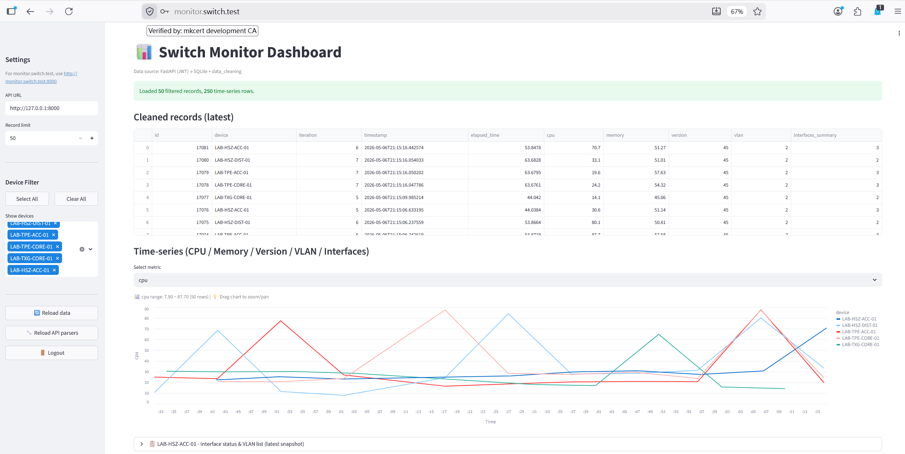

# Cisco Switch Real-time Monitor Engine

[](https://github.com/Lucien0420/cisco-switch-monitor/actions/workflows/ci.yml)
[](https://www.python.org/)
[](https://opensource.org/licenses/MIT)

**Languages:** [English](README.md) · [繁體中文](README.zh-TW.md)

A high-performance monitoring engine designed for Cisco network infrastructure (Catalyst 9000 / IOS-XE). Built on an **ETL (Extract-Transform-Load)** architecture, it utilizes **Netmiko** for concurrent data ingestion, **FastAPI** for structured data delivery, and **Streamlit** for a professional NOC dashboard.



**Demo Video (YouTube):** [Watch Full Demo](https://youtu.be/_uXNgmTwpDw) — Showcasing concurrent polling, real-time metrics, and HTTPS setup.

---

## Core Architecture: ETL Data Pipeline

The project is built around a robust data pipeline, ensuring scalability from raw CLI output to interactive visualizations:

1.  **Extract**: `monitor.py` leverages `driver.py` (Netmiko) to establish SSH connections and execute `show` commands on multiple devices concurrently.
2.  **Transform**: `data_cleaning.py` uses optimized Regex parsers to convert unstructured CLI text into structured JSON objects.
3.  **Load**: `database.py` persists structured metrics into a **SQLite** time-series database for historical analysis.

---

## Key Features

- **Concurrent Monitoring**: Uses `ThreadPoolExecutor` for non-blocking I/O, supporting dozens of devices simultaneously.
- **Dynamic Metric Parsing**: Built-in parsers for `cpu`, `memory`, `version`, `vlan`, and `interfaces`. Supports hot-reloading via `/reload-parsers`.
- **Professional Simulator**: Includes `sim/switch_simulator.py`, a multi-threaded SSH server that mimics real Cisco devices with dynamic CPU spikes and memory leaks.
- **Interactive NOC Dashboard**:
    - **Device Filtering**: Sidebar multiselect for quick focus on specific assets.
    - **Time-series Analysis**: Altair-powered charts with interactive zoom, pan, and metric switching.
    - **Inventory Tracking**: Real-time snapshots of `show inventory` and detailed interface statuses.
- **Enterprise Security**: FastAPI + OAuth2 (JWT) authentication with Nginx reverse proxy and HTTPS (mkcert) support.

---

## Tech Stack

| Layer | Technology |
|------|------|
| **Language** | Python 3.10+ |
| **Driver** | Netmiko 4.3.0 (Paramiko-based) |
| **Concurrency** | Multi-threading (ThreadPoolExecutor) |
| **Storage** | SQLite |
| **Backend** | FastAPI, Uvicorn |
| **Frontend** | Streamlit, Altair, Pandas |
| **Testing** | Pytest |
| **Deployment** | Docker (Optional), Nginx, mkcert |

---

## Professional Switch Simulator (Supporting Role)

Beyond simple data mocking, this is a full-blown **SSH Server** implemented with **Paramiko**, offering significant technical depth:

- **Protocol Fidelity**: Supports real SSH handshakes, authentication, and interactive shell simulation. The monitoring engine treats it as a genuine Cisco device.
- **Session Personality**: Each SSH session generates unique base values and timing offsets for realistic data variation.
- **Dynamic Trends**:
    - **CPU**: Sinusoidal waves + random bursts.
    - **Memory**: Simulated persistent memory leaks.
    - **Interface**: Random Up/Down state toggling for specific ports.
- **Concurrency Ready**: A single simulator instance handles multiple concurrent SSH connections seamlessly, perfect for large-scale stress testing.
- **Development Edge**: Enables 100% offline development and robust CI/CD pipelines without relying on external sandboxes.

---

## Quick Start

### 1. Environment Setup

```bash
git clone <repository-url>
cd switch
python -m venv venv
source venv/bin/activate        # Windows: venv\Scripts\activate
pip install -r requirements.txt
pip install -r requirements-dev.txt
```

### 2. Launch Simulator & Engine

#### Option A: Manual Launch (Local)

```bash
# Start 5 simulated switches in the background
for port in {2222..2226}; do
  python3 sim/switch_simulator.py --port $port &
done

# Start Monitoring, API, and Dashboard
bash scripts/restart_all.sh
```

#### Option B: Docker Compose (Recommended)

```bash
# 1. Prepare Docker-specific config
cp devices.docker.json.example devices.json

# 2. One-click launch everything (including 5 simulators)
docker-compose up -d
```

Access the dashboard at **http://localhost:8501**.

---

## Testing & CI

Automated tests ensure the integrity of the ETL transformation logic:

```bash
# Run unit tests
python3 -m pytest tests/
```

GitHub Actions automatically runs these tests on every push to verify the ETL pipeline and API health.

---

## Project Structure

```text
.
├── main.py                  # Entry Point: Schedules concurrent polling
├── api.py                   # REST API: JWT Auth & Structured Data
├── streamlit_app.py         # Dashboard: Interactive Visualization
├── data_cleaning.py         # ETL Transform: Regex Parsing Core
├── driver.py                # Netmiko Wrapper: SSH Communication
├── sim/
│   └── switch_simulator.py  # Professional Simulator: Dynamic Metrics
├── tests/                   # Automated Test Suite
├── data/                    # SQLite Database (gitignored)
└── docs/                    # Technical Docs & HTTPS Setup
```

---

## License

MIT License — see [LICENSE](LICENSE) for details.
