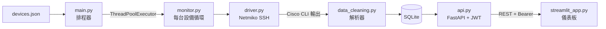

# Cisco 交換機即時監控系統

**語言：** [English](README.md) · [繁體中文](README.zh-TW.md)

針對 Cisco 網路設備（Catalyst 9000 / IOS-XE）的即時監控系統。透過 SSH / Netmiko 採集指標、以 SQLite 儲存時序資料，並提供含互動式圖表、介面／VLAN 狀態表格與 CSV 匯出的 Web 儀表板。


**Demo 影片（YouTube）：**[觀看完整展示](https://youtu.be/_uXNgmTwpDw) — 包含登入、即時指標圖表、介面／VLAN 表格、多設備並發採集與 HTTPS 設定完整流程。

---

## 系統概覽



每台設備在獨立執行緒中運行。原始 CLI 輸出即時解析並寫入 SQLite。FastAPI 後端向 Streamlit 儀表板提供 REST 介面，儀表板輪詢更新並渲染時序圖與狀態表格。

---

## 核心功能

| 功能 | 說明 |
|------|------|
| **多設備並發監控** | `ThreadPoolExecutor` 同時監控多台交換機，每台設備獨立輪詢循環 |
| **6 種內建指標** | `cpu`、`memory`、`version`（運行天數）、`vlan`（數量）、`interfaces`（詳細狀態）、`interfaces_summary`（up 數量） |
| **可擴展解析器** | `data_cleaning.py` 以鍵值映射解析函式；新增解析器不影響其他模組。支援 `/reload-parsers` 熱重載 |
| **REST API** | FastAPI + OAuth2 密碼流（JWT）；受保護端點回傳清洗後、時序、原始記錄 |
| **互動式儀表板** | 登入頁 → 指標選擇 → Altair 時序圖（x 軸縮放／平移）→ 介面與 VLAN 表格；指標選擇透過 `st.session_state` 跨重載保留 |
| **CSV 匯出** | 從瀏覽器直接下載當前資料集為 `.csv` 檔案 |
| **HTTPS 支援** | mkcert 本地可信憑證；nginx 反向代理 + 自訂域名（`monitor.switch.test`） |
| **本地模擬** | `sim/fake_switch_ssh.py` — 基於 Paramiko 的本地 SSH 伺服器，可離線測試 |

---

## 技術棧

| 層級 | 技術 |
|------|------|
| Python | 3.10+ |
| SSH / 設備連線 | Netmiko 4.3.0、Paramiko |
| 並發處理 | `ThreadPoolExecutor`（標準庫） |
| 資料庫 | SQLite（標準庫） |
| API 後端 | FastAPI、Uvicorn |
| 身份驗證 | OAuth2 密碼流、PyJWT |
| 儀表板 | Streamlit、Altair、pandas、httpx |
| HTTPS | mkcert、nginx |
| 日誌 | `RotatingFileHandler`（10 MB × 5 份備份） |
| 目標設備 | Cisco IOS-XE / Catalyst 9000 |

---

## 適用場景

- 內部維運團隊的多設備網路健康儀表板
- SSH 自動化、時序資料流水線與 REST API 設計的作品集展示
- 透過替換解析器函式，可擴展支援 Juniper／Arista／HP 等廠商

---

## 事前準備

- Python 3.10+
- 目標 Cisco 設備的 SSH 存取權限（IOS / IOS-XE / Catalyst 9000）
- [Cisco DevNet 沙箱](https://developer.cisco.com/)（免費；測試不需實體硬體）

---

## 快速開始

```bash
git clone <repository-url>
cd switch
python -m venv venv
source venv/bin/activate        # Windows: venv\Scripts\activate
pip install -r requirements.txt
cp devices.json.example devices.json
# 填入設備 IP、帳號密碼與監控指令
bash scripts/restart_all.sh
```

開啟 **http://localhost:8501**（儀表板）或 **http://localhost:8000/docs**（API 文件）。

---

## 設定說明

### 設備清單（`devices.json`）

```json
[
  {
    "name": "DevNet_Catalyst9000",
    "ip": "devnetsandboxiosxec9k.cisco.com",
    "port": 22,
    "username": "your_username",
    "password": "your_password",
    "device_type": "cisco_ios",
    "timeout": 15,
    "collect_commands": [
      { "key": "version",             "command": "show version" },
      { "key": "cpu",                 "command": "show processes cpu" },
      { "key": "memory",              "command": "show memory statistics" },
      { "key": "interfaces",          "command": "show interfaces status" },
      { "key": "vlan",                "command": "show vlan brief" },
      { "key": "interfaces_summary",  "command": "show interfaces summary" }
    ]
  }
]
```

陣列中可填入多台設備，系統將同步並發監控。

### 環境變數（`.env`）

| 變數 | 說明 | 預設值 |
|------|------|--------|
| `ADMIN_USER` | 儀表板／API 登入帳號 | `admin` |
| `ADMIN_PWD` | 儀表板／API 登入密碼 | `admin` |
| `JWT_SECRET` | JWT 簽名金鑰 | `change-me-in-production` |
| `MONITOR_DB_DIR` | 資料庫目錄 | `data` |
| `MONITOR_DB_NAME` | 資料庫檔名 | `dvt_monitor_results.db` |

---

## 使用方式

### 一鍵啟動所有服務（推薦）

```bash
bash scripts/restart_all.sh
```

自動終止舊進程、清理 Python 快取，再以 `nohup` 啟動三個背景進程：

| 進程 | 指令 | 埠號 | 日誌 |
|------|------|------|------|
| 資料採集 | `python main.py` | — | `logs/main.log` |
| API | `uvicorn api:app` | 8000 | `logs/api.log` |
| 儀表板 | `streamlit run streamlit_app.py` | 8501 | `logs/streamlit.log` |

### 手動啟動（三個終端）

```bash
# 終端 1 — 資料採集
python main.py

# 終端 2 — API
uvicorn api:app --host 0.0.0.0 --port 8000

# 終端 3 — 儀表板
streamlit run streamlit_app.py --server.port 8501 --server.address 0.0.0.0
```

### 存取網址

| 服務 | 網址 |
|------|------|
| 儀表板 | http://localhost:8501 |
| 儀表板（HTTPS） | https://monitor.switch.test *（nginx + mkcert）* |
| API 文件（Swagger） | http://localhost:8000/docs |
| 健康檢查 | http://localhost:8000/health |

---

## API 端點

| 方法 | 路徑 | 驗證 | 說明 |
|------|------|------|------|
| POST | `/token` | 無 | OAuth2 密碼流 → JWT |
| GET | `/health` | 無 | 健康檢查 + 解析器狀態 |
| GET | `/reload-parsers` | 無 | 熱重載 `data_cleaning` 模組 |
| GET | `/records` | Bearer | 原始監控記錄 |
| GET | `/cleaned` | Bearer | 解析後記錄（結構化欄位） |
| GET | `/time_series` | Bearer | 時序資料（供圖表使用） |
| GET | `/devices` | Bearer | 設備清單（密碼遮罩） |

---

## 儀表板功能

1. **登入** — 透過 FastAPI `/token` 端點驗證身份
2. **指標選擇** — 從 `cpu`、`memory`、`version`、`vlan`、`interfaces_summary` 中選擇；選擇透過 `st.session_state` 跨重載保留
3. **時序圖** — Altair 圖表，支援 x 軸互動式縮放與平移；每台設備顯示為獨立折線
4. **介面狀態表** — 來自 `show interfaces status` 的逐介面狀態
5. **VLAN 表** — 來自 `show vlan brief` 的 VLAN 清單
6. **CSV 匯出** — 直接從瀏覽器下載當前資料集

---

## HTTPS（本地開發）

無需購買域名即可取得瀏覽器信任的 `https://` 網址：

- **Linux / WSL2**：參見 [`docs/HTTPS_SETUP.md`](docs/HTTPS_SETUP.md)
- **WSL2 + Windows 瀏覽器**：參見 [`docs/HTTPS_WSL2_WINDOWS.md`](docs/HTTPS_WSL2_WINDOWS.md) — 憑證須在 Windows 產生後複製到 WSL 供 nginx 使用

---

## 專案結構

```
switch/
├── main.py                  # 入口 — 載入 devices.json，執行排程器
├── api.py                   # FastAPI 後端
├── streamlit_app.py         # Streamlit 儀表板
├── monitor.py               # 每台設備的監控循環
├── driver.py                # Netmiko SSH 封裝
├── scheduler.py             # ThreadPoolExecutor 任務執行器
├── data_cleaning.py         # CLI 輸出解析器（支援熱重載）
├── database.py              # SQLite 讀寫工具
├── logger_config.py         # Rotating Log 設定
├── config.py                # 統一設定中心 — 所有環境變數集中於此
├── devices.json.example     # 設備設定範本（可安全提交）
├── .env.example             # 環境變數範本（可安全提交）
├── requirements.txt
├── images/                  # README 截圖
├── sim/
│   └── fake_switch_ssh.py   # Paramiko SSH 伺服器（離線測試用）
├── scripts/
│   ├── restart_all.sh       # 啟動所有服務（nohup 背景執行）
│   └── setup_https_mkcert.sh
├── certs/                   # SSL 憑證（gitignored）
├── data/                    # SQLite 資料庫（gitignored）
├── logs/                    # Rotating 日誌（gitignored）
└── docs/
    ├── HTTPS_SETUP.md
    ├── HTTPS_WSL2_WINDOWS.md
    └── TECHNICAL_OVERVIEW.md
```

---

## 安全說明

- `devices.json`（含真實帳密）已列入 gitignore — 只有 `devices.json.example` 會提交
- `certs/`、`data/`、`logs/` 均已 gitignore
- 正式部署前請設定強密度的 `JWT_SECRET`

---

## 授權

MIT
